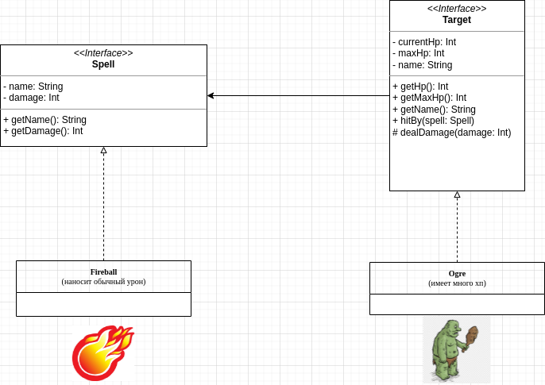
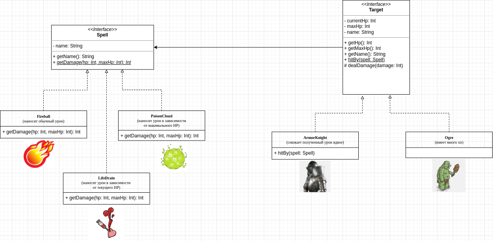

### Часть 1.
Есть два типа сущностей: **заклинания** и **герои**. Заклинания должны наносить урон героям.

### Часть 2.
1. Добавлены заклинания, чей **урон зависит от здоровья** героя.
2. Добавлены герои, которые способны **уменьшать получаемый урон**.

